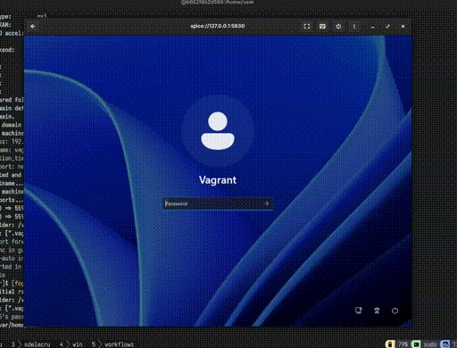

# containers

> **Note:** This setup has been tested on Fedora 43. Other distributions may require adjustments.

## Run Windows 11 VM with Vagrant (libvirt)



### Prerequisites

Install system packages and Vagrant (Fedora/RHEL):

```bash
# System packages
sudo dnf install -y libvirt qemu-kvm edk2-ovmf virt-install expect rsync sshpass
sudo systemctl enable --now libvirtd

# Vagrant
sudo dnf install -y vagrant
# Plugins (required)
vagrant plugin install vagrant-libvirt vagrant-reload winrm winrm-elevated --local
```

### Prepare optional binaries (auto-installed)

- **SPICE Guest Tools**: Automatically downloaded from <https://www.spice-space.org> during provisioning if not found locally. Optionally, place `win/binary/spice-guest-tools-latest.exe` on the host to skip the download and speed up provisioning.
- **flightctl**: Place `win/binary/flightctl.zip` on the host. The provisioner will extract and install it to `C:\flightctl\flightctl.exe` and add it to the system PATH. Uncomment the flightctl provisioner in `win/Vagrantfile` (lines 151-184) to enable installation.
- **flightctl login**: Automatically logs into flightctl service during provisioning if the endpoint is reachable. The provisioner tests connectivity before attempting login and gracefully skips if the endpoint is unavailable. Configure via environment variables (see Environment Variables section below). The login provisioner is enabled by default in `win/Vagrantfile` (lines 190-232). Comment it out if not needed.

### Start the VM

```bash
# From repo root
cd win
# Optional: override what gets synced to C:\Users\Vagrant
export HOST_SYNC_DIR="${PWD}"   # defaults to /home/user if unset

# Optional: Configure flightctl login (requires login provisioner to be uncommented)
export FLIGHTCTL_ENDPOINT="https://api.192.168.1.21.nip.io:3443"
export FLIGHTCTL_INSECURE="true"
export FLIGHTCTL_NO_AUTH="true"

vagrant up
```

Or run via the helper script (automates plugins, base box, and post-setup):

```bash
# From repo root
cd win
export HOST_SYNC_DIR="${PWD}"   # optional; defaults to /home/user

# Optional: Configure flightctl login (requires login provisioner to be uncommented)
export FLIGHTCTL_ENDPOINT="https://api.192.168.1.21.nip.io:3443"
export FLIGHTCTL_INSECURE="true"
export FLIGHTCTL_NO_AUTH="true"

bash startup.sh
```

What happens:

- Boots the Windows 11 Vagrant box under libvirt (UEFI, SPICE graphics).
- Syncs `HOST_SYNC_DIR` into `C:\Users\Vagrant` (rsync).
- Runs provisioning scripts:
  1. Restarts the Windows Task Scheduler service
  2. Installs OpenSSH server and Chocolatey package manager
  3. Installs rsync for file syncing
  4. Tests internet connectivity to 8.8.8.8 and <www.spice-space.org>
  5. Downloads and installs SPICE Guest Tools (or uses local binary from `win/binary/spice-guest-tools-latest.exe` if available)
  6. **Reboots the VM** to activate SPICE Guest Tools drivers
  7. Installs flightctl client (if provisioner is uncommented in Vagrantfile)
  8. Checks connectivity to flightctl endpoint and logs in if available (enabled by default, gracefully skips if endpoint is unreachable)

All installation steps are logged with timestamps to `C:\Windows\Temp\` for troubleshooting:

- `spice-install-vagrant.log` - SPICE installation from Vagrantfile inline provisioner
- `spice-install.log` - SPICE installation from `scripts/install-spice-tools.ps1`
- `flightctl-install.log` - flightctl installation from `scripts/install-flightctl.ps1`
- `flightctl-install-inline.log` - flightctl installation from inline provisioner
- `flightctl-login.log` - flightctl login from login provisioner

### Environment Variables

The following environment variables can be set on the host before running `vagrant up` or `startup.sh`:

**General:**
- `HOST_SYNC_DIR` - Directory to sync to `C:\Users\Vagrant` in the guest (default: `/home/user`)

**flightctl Configuration** (used by login provisioner in Vagrantfile lines 190-232):
- `FLIGHTCTL_ENDPOINT` - flightctl service URL (default: `https://api.192.168.1.21.nip.io:3443`)
- `FLIGHTCTL_INSECURE` - Skip TLS verification: `true` or `1` (default: `true`)
- `FLIGHTCTL_NO_AUTH` - Disable authentication for local deployments: `true` or `1` (default: `true`)
- `FLIGHTCTL_USE_TOKEN` - Use token authentication: `true` or `1` (default: empty)
- `FLIGHTCTL_TOKEN` - Access token for token-based authentication (default: empty)
- `FLIGHTCTL_USERNAME` - Username for PAM authentication (default: empty)
- `FLIGHTCTL_PASSWORD` - Password for PAM authentication (default: empty)

These variables are read by Vagrant and passed to the Windows guest during provisioning.

### Connect via SPICE

- Run from your laptop: `remote-viewer spice://127.0.0.1:5930`
- SPICE listen/address/port are set in `win/Vagrantfile` and default to `127.0.0.1:5930`.

### Troubleshooting

**WinRM provisioning failures:**

- Check log files on the Windows guest in `C:\Windows\Temp\`:
  - `spice-install-vagrant.log` or `spice-install.log`
  - `flightctl-install.log` or `flightctl-install-inline.log`
- Access logs via: `vagrant winrm -c "type C:\Windows\Temp\spice-install-vagrant.log"`
- Enable verbose Vagrant output: `VAGRANT_LOG=info vagrant up`

**Common issues:**

- **Exit code 267011**: This was caused by `powershell_elevated_interactive: true` which has been fixed. All provisioners now use `privileged: true` for proper WinRM compatibility.
- **Variable $host is read-only**: Fixed by renaming loop variables to avoid PowerShell automatic variables.
- **Internet connectivity failures**: The connectivity test now uses `$ErrorActionPreference = 'Continue'` and will warn but not fail provisioning.
- **VM reboots during provisioning**: This is expected! The VM automatically reboots after installing SPICE Guest Tools to activate the drivers. Vagrant will reconnect and continue provisioning.
- **flightctl login skipped during provisioning**: The provisioner checks connectivity to the flightctl endpoint before attempting login. If the endpoint is unreachable, it will display a warning and skip the login step. This is normal if the flightctl service is not running yet or the endpoint is incorrect. You can manually login later using the script at `C:\Users\Vagrant\scripts\flightctl-login.ps1`.

**Re-provisioning:**

```bash
# Re-run all provisioners
vagrant provision

# Destroy and rebuild from scratch
vagrant destroy -f && vagrant up
```

### Installation Scripts

The `win/scripts/` directory contains PowerShell scripts for automated software installation:

- **`install-spice-tools.ps1`**: Installs SPICE Guest Tools with automatic download fallback
  - Checks for local binary at `C:\Users\vagrant\binary\spice-guest-tools-latest.exe`
  - Downloads from spice-space.org if not found locally
  - Logs to `C:\Windows\Temp\spice-install.log`

- **`install-flightctl.ps1`**: Installs flightctl CLI client
  - Extracts flightctl.exe from provided zip file
  - Installs to `C:\flightctl\flightctl.exe`
  - Adds installation directory to system PATH
  - Broadcasts environment variable changes to running processes
  - Logs to `C:\Windows\Temp\flightctl-install.log`
  - Requires `-ZipPath` parameter (e.g., `-ZipPath "C:\Users\Vagrant\binary\flightctl.zip"`)

- **`flightctl-login.ps1`**: Authenticates to flightctl service
  - Supports three authentication modes:
    1. **No authentication** (local deployments with auth disabled)
    2. **Token-based** authentication
    3. **Username/password** (PAM) authentication
  - Reads configuration from environment variables:
    - `$env:FLIGHTCTL_ENDPOINT` (required) - flightctl service URL
    - `$env:FLIGHTCTL_INSECURE` - set to `true` or `1` to skip TLS verification (adds `-k` flag)
    - `$env:FLIGHTCTL_NO_AUTH` - set to `true` or `1` for no authentication (local deployments)
    - `$env:FLIGHTCTL_USE_TOKEN` - set to `true` or `1` to use token authentication
    - `$env:FLIGHTCTL_TOKEN` - for token authentication
    - `$env:FLIGHTCTL_USERNAME` and `$env:FLIGHTCTL_PASSWORD` - for username/password auth
  - Command-line switches (`-NoAuth`, `-Insecure`, `-UseToken`) override environment variables
  - Verifies login by checking current context
  - Logs to `C:\Windows\Temp\flightctl-login.log`
  - Example usage:
    ```powershell
    # Local deployment (no auth, insecure) - using environment variables
    $env:FLIGHTCTL_ENDPOINT = "https://api.192.168.1.21.nip.io:3443"
    $env:FLIGHTCTL_NO_AUTH = "true"
    $env:FLIGHTCTL_INSECURE = "true"
    .\scripts\flightctl-login.ps1

    # Token authentication - using environment variables
    $env:FLIGHTCTL_ENDPOINT = "https://flightctl.example.com"
    $env:FLIGHTCTL_TOKEN = "your-token-here"
    $env:FLIGHTCTL_USE_TOKEN = "true"
    .\scripts\flightctl-login.ps1

    # Username/password authentication - using environment variables
    $env:FLIGHTCTL_ENDPOINT = "https://flightctl.example.com"
    $env:FLIGHTCTL_USERNAME = "admin"
    $env:FLIGHTCTL_PASSWORD = "password"
    .\scripts\flightctl-login.ps1

    # Using command-line switches (overrides env vars)
    .\scripts\flightctl-login.ps1 -NoAuth -Insecure
    .\scripts\flightctl-login.ps1 -UseToken -Insecure
    ```

All scripts require Administrator privileges and include comprehensive error handling with timestamped logging.

## Generate qcow2 images from container images

This repository contains bootc-based container images that can be converted to qcow2 disk images for use with libvirt, QEMU, or other virtualization platforms.

### Prerequisites

- Podman (for building and running containers)
- bootc-image-builder (available as a container image)
- Sufficient disk space (each qcow2 image is several GB)

### Automated generation (via make-vm.sh)

The `make-vm.sh` script automates the entire process including qcow2 generation. See the [Run all Flightctl VMs](#run-all-flightctl-vms-with-make-vmsh-) section below.

## Run all Flightctl VMs with make-vm.sh

The `make-vm.sh` script builds a bootable image per release directory (e.g., `centos9`, `rhel96`, `rhel96_fips`) and then creates/boots a libvirt VM.

Prerequisites (host):

- 🐋 Podman, qemu-kvm, libvirt, virt-install
- 🌐 Network access to OpenShift and flightctl endpoints
- 💾 Sufficient disk space (each VM image ~ several GB)

Run for a single release:

```bash
# From repo root
./make-vm.sh centos9
# or
./make-vm.sh rhel96
# or
./make-vm.sh rhel96_fips
```

Run all supported releases:

```bash
for r in centos9 rhel96 rhel96_fips; do
  ./make-vm.sh "$r"
done
```

What the script does:

- Logs into OpenShift and flightctl using embedded endpoints/tokens
- Builds the container image under the selected release directory
- Uses bootc-image-builder to generate a qcow2
- Imports and expands the qcow2, then launches a transient libvirt VM:
  - VM name: `flightctl-<release>`
  - Disk path: `/var/lib/libvirt/images/flightctl-<release>.qcow2`

Manage VMs 🧑‍✈️:

```bash
# List
virsh list --all

# Stop and remove a VM (example: centos9)
VM=flightctl-centos9
virsh destroy "$VM" 2>/dev/null || true
virsh undefine "$VM" 2>/dev/null || true
sudo rm -f "/var/lib/libvirt/images/${VM}.qcow2"
```

Notes:

- The script currently targets Linux releases; the `win/` directory is separate and uses Vagrant/libvirt inside a container (see section above).
- If you need to override endpoints or tokens, edit `make-vm.sh` variables at the top (`OPENSHIFT_API`, `OPENSHIFT_TOKEN`, `FLIGHTCTL_API`) or export env vars that the helper finders (`OC_BIN`, `FLIGHTCTL_BIN`) respect.

## TODO ✅

- Validate container flow on RHEL, Fedora Silverblue, and Ubuntu hosts.
- Replace iptables with firewalld/nftables-aware rules where available.
- Improve Windows rsync: switch to push-on-change or periodic sync; exclude more locked paths.
- Add more poweshell scripts that execute flightctl binary commands and return a report of passed and failed
- Optional SMB path (documented) for non-RDP workflows.
- Parameterize CPU/RAM and RDP ports via env vars in `startup.sh`.
- Add cleanup script to remove VMs, networks, and temporary NVRAM files.
- Cache/prefetch Vagrant boxes in image build with version pins.
